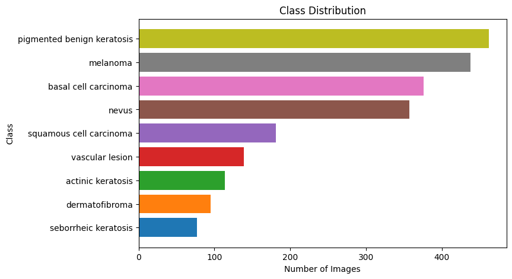
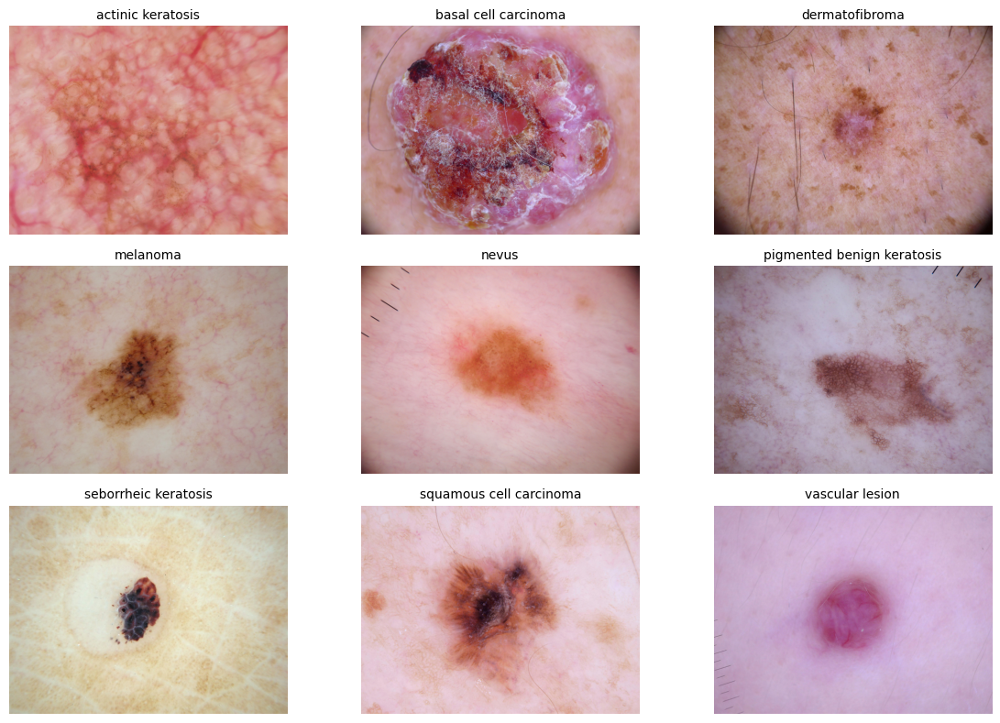

# Comparing Machine Learning and Deep Learning on Skin Cancer Classification

## Motivation and Overview
Skin cancer is one of the most common types of cancer diagnosed worldwide. It is also one of the most treatable if detected early enough. Convolutional neural networks (CNNs) have achieved strong performance on clean, balanced datasets, but struggle in realistic medical settings where data is limited and class imbalance is severe. These models also lack interpretability and transparency in their decision making, a critical limitation in the medical field. This project evaluates an alternative pipeline on a small, highly imbalanced dataset that reflects realistic medical datasets. Using handcrafted features based on the ABCD dermatological criteria, this project trained an XGBoost model that acheieved a macro-averaged F1-score of 79%, compared to 52% achieved by a ResNet50 model, while providing interpretable feature importance.

Authors: Diego Maldonado, Sidhantaa Sarna, Tiffany De La Cruz

---
 
## Data
 
| Attribute     | Details                        |
|---------------|--------------------------------|
| **Source**    | [Skin Cancer ISIC Dataset](https://www.kaggle.com/datasets/nodoubttome/skin-cancer9-classesisic)      |
| **Type**      | Dermoscopic imaages, JPG  |
| **Size**      | 2,357 images, 9 classes, 782 MB

- - -
## Exploratory Data Analysis

### Class Imbalance

The graph above visualizes the high class imbalance in the dataset, the main problem with the dataset. In such a small dataset, this imbalance is exacerbated. However, this initial observation inspired our alternative approach. Studies have shown that despite their complexity, deep learning models still underperform on small and imbalanced tabular datasets compared to tree-based models. (Grinsztajn et al., 2022)  

 

### Visual Simularity & Artifacts

A sample plot of images from each class tells us several things. Firstly, many of the classes closely resemble each other, making a classification task even more difficult. Additionally, there are artifacts such as hair follicles and edges of dermoscopic that would distract the CNN. 

### Varying Image Sizes

  
   

These two plots highlight the variability in image sizes in the dataset. Melanoma, nevus, and sebhorreic keratosis had significantly bigger images compared to the other classes. Initial CNN modeling attempts directly resized the images down to 224x224. compressing the larger images and distorting lesion boundaries.

## Data Preprocessing
After applying a stratified split in both pipelines, the following preprocessing steps were taken:

<ins>Deep Learning</ins>
- Apply DullRazor algorithm to remove hair follicles (Lee et al., 1997)
- Resize shortest side of the image to 256
- Center crop an area of 224x224
- Normalizing images 

<ins>Machine Learning</ins>
- Extract raw features from each image
- Engineer ABCD, color moment, color contrast, and color ratio features 
- Save results in a CSV file for later training

## Modeling Choice and Training
The following models were trained and evaluated:

## How to Run
1. 

## Future Work
1. Evaluate the performance of other types of deep learning models, such as transformers or CNN custom-trained on dermoscopic images.
2. Add non-dermoscopic images of skin cancer to create a more robust dataset. This can help create a model suitable for deployment to the public, and not just as a diagnostic tool for dermatologists.
3. Test the feature extraction pipeline on other skin cancer datasets and determine if the engineered features are still the most relevant to classification.

## Repository Structure

- README.md: Summary and overview of the project
- requirements.txt: Python dependencies
- dataset/
  - sample_images: Small sample of the dataset
  - SC_Dataset_9_Classes.csv: CSV file of hand-crafted features
- notebooks/
  - EDA.ipynb: Creates EDA visualizations for the dataset
  - Image_to_Tabular_Pipeline.ipynb: Creates the 'SC_Dataset_9_Classes,csv'
- scripts/
  - download_data.py: Downloads and unzips dataset into directory
  - preprocess.py: Splits training set and applies preprocessing to all images
- models/
  - resnet50.keras: Saved ResNet50 model
  - rf_9_classes_model.pkl: Saved Random Forest model
  - xgb_best_model.pkl: Saved XGBoost model 
- images: Contains the images used in the README.md file

## References

- Grinsztajn, L., Oyallon, E., & Varoquaux, G. (2022). Why do tree-based models still outperform deep learning on tabular data? arXiv. https://arxiv.org/abs/2207.08815
- Lee, T., Ng, V., Gallagher, R., Coldman, A., & McLean, D. (1997). DullRazor: a software approach to hair removal from images. Computers in biology and medicine, 27(6), 533–543. https://doi.org/10.1016/s0010-4825(97)00020-6