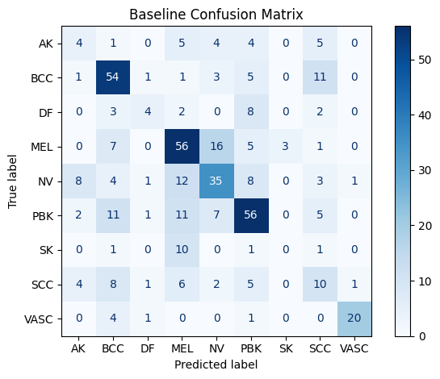
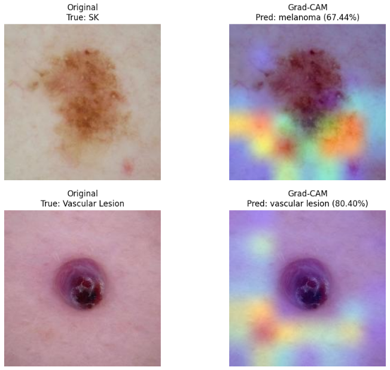

# Comparing Machine Learning and Deep Learning on Skin Cancer Classification

## Motivation and Overview
Skin cancer is one of the most common types of cancer diagnosed worldwide. It is also one of the most treatable if detected early enough. Convolutional neural networks (CNNs) have achieved strong performance on clean, balanced datasets, but struggle in realistic medical settings where data is limited and class imbalance is severe. These models also lack interpretability and transparency in their decision making, a critical limitation in the medical field. This project evaluates an alternative pipeline on a small, highly imbalanced dataset that reflects realistic medical datasets. Using handcrafted features based on the ABCD dermatological criteria, this project trained an XGBoost model that achieved a macro-averaged F1-score of 50%, compared to 43% achieved by a MobileNetV2 model, while providing interpretable feature importance.

Authors: Diego Maldonado, Sidhantaa Sarna, Tiffany De La Cruz

---
 
## Data
 
|    |                         |
|---------------|--------------------------------|
| **Source**    | [Skin Cancer ISIC Dataset](https://www.kaggle.com/datasets/nodoubttome/skin-cancer9-classesisic)      |
| **Type**      | Dermoscopic images, JPG  |
| **Size**      | 2,357 images, 9 classes, 782 MB

- - -
## Exploratory Data Analysis
Initial data exploration revealed several issues that would require significant preprocessing.

### Class Imbalance

The graph above visualizes the severe class imbalance present in the dataset. This initial observation inspired our alternative approach. Studies have shown that despite their complexity, deep learning models still underperform on small and imbalanced tabular datasets compared to tree-based models. (Grinsztajn et al., 2022)  

 

### Visual Similarity & Artifacts

A sample plot of images from each class tells us several things. Firstly, many of the classes closely resemble each other, making a classification task even more difficult. Additionally, there are artifacts such as hair follicles and edges of the  dermoscopic lens that would distract the CNN. 

### Varying Image Sizes

  
   

These two plots highlight the variability in image sizes in the dataset. Melanoma, nevus, and seborrheic keratosis had significantly bigger images compared to the other classes. Initial CNN modeling directly resized the images down to 224x224, but this resulted in compression of larger images and distortion of lesion boundaries. 

## Data Preprocessing
After applying a stratified split in both pipelines, the following preprocessing steps were taken:

<ins>Deep Learning</ins>
- Apply DullRazor algorithm to remove hair follicles (Lee et al., 1997)
- Resize shortest side of the image to 256
- Center crop an area of 224x224
- Normalize images 

<ins>Machine Learning</ins>
- Extract raw features from each image
- Engineer ABCD, color moment, color contrast, and color ratio features 
- Save results in a CSV file for later training

## Modeling Training and Hyperparameters
The following models were trained on Google Colab using GPU runtime. The CNN is trained conventionally. The machine learning models are hyperparameter tuned before being evaluated.
- MobileNetV2: Lightweight baseline. Used extensively in image classification.
  - optimizer = 'adam'
  - lr = 0.001
  - loss = 'categorical crossentropy' 
  - epochs = 20
  - batch = 32
- Random Forest: Used in classical computer vision to great success, handles imbalances well.
  - n_estimators = 300
  - min_samples_split = 3
  - min_samples_leaf = 1
  - max_features = "sqrt"
  - max_depth = 30
- XGBoost: One of the best performing tree-based models. Also has been used extensively in classical computer vision.
  - subsample = 0.8
  - reg_lambda = 1.0
  - reg_alpha = 0.0
  - n_estimators = 300
  - max_depth = 5
  - learning_rate = 0.1
  - colsample_bytree = 1.0

## Results
| Model  | Macro-Averaged F1-Score |
| ------------- | ------------- |
| MobileNetV2  | 43%  |
| Random Forest  | 49%  |
| XGBoost       | 50%   |

Given the high class imbalance, macro-averaged F1-score was the main metric for comparison across the models. Metrics such as accuracy aren't useful since it can give misleading high scores. 

### MobileNetV2

As predicted, the model predicted mostly majority classes such as pigmented benign keratosis. Interestingly, almost all of the vascular lesion images are classified correctly, despite it being one of the smaller classes. We believe the distinct red-purplish color of vascular lesions is the reason for this behavior. The smallest class, seborrheic keratosis, is missed completely by the model.

 

  
   

The Grad-CAM and LIME visualize the areas of an image that a CNN is learning from the most when making a prediction. As expected, the model is only focusing on non-lesion areas when classifying seborrheic keratosis. However, even when the model is analyzing an image from a high performing class like vascular lesion, it is still heavily focusing on non-lesion areas. This implies that even in cases where the model predicts the class correctly, it is using non-lesion areas and not the cancer itself to make the prediction. 

 

### Random Forest and XGBoost

  
   

Looking at the confusion matrices for both machine learning models, we can see an immediate improvement from the CNN baseline. For example, both models correctly classified more instances of pigmented benign keratosis and melanoma compared to MobileNetV2. However, these models are still struggling to identify minority classes.

  

  
   

One of the main advantages of the machine learning models is their interpretability. For both models, engineered features based on ABCD criteria were the most important in model predictions. This includes features such as diameter_estimate, asymmetry ratio, and min_area_rect_height.  Since so many of the classes look similar, the raw extracted features had relatively less importance. 

## Conclusion
This project has shown that machine learning models can outperform CNNs on classification tasks in situations with limited data or highly imbalanced data. Although CNNs are powerful models, they are not the best use case in every situation. Instead of training a complicated black-box model, one can train a machine learning model and achieve superior performance compared to CNNs. Additionally, the ability to view feature importance is one of the strongest advantages of this pipeline. Despite the ability to see what parts of an image a CNN is learning from, it is difficult to understand why the model is focusing on a specific part of an image. Since the pipeline uses dermatological criteria as a basis for its extracted features, it allows for potential future use as a diagnostic tool for dermatologists. 

## Future Work
1. Evaluate the performance of other types of deep learning models, such as transformers or CNN custom-trained on dermoscopic images.
2. Add non-dermoscopic images of skin cancer to create a more robust dataset. This can help create a model suitable for deployment to the public, and not just as a diagnostic tool for dermatologists.
3. Test the feature extraction pipeline on other skin cancer datasets and determine if the engineered features are still the most relevant to classification.

## How to Run
1. Clone the repository
2. Install dependencies (pip install -r requirements.txt)
3. Download data using download_data.py

For deep learning:
1. Run preprocess.py
2. Run MobileNetV2Training.ipynb

For machine learning:
1. Run Image_to_Tabular_Pipeline.ipynb
2. Run RF_9_classes.ipynb
3. Run xgBoost_final.ipynb
## Repository Structure

- README.md: Summary and overview of the project
- requirements.txt: Python dependencies
- dataset/
  - sample_images: Small sample of the dataset
  - SC_Dataset_9_Classes.csv: CSV file of hand-crafted features
- notebooks/
  - EDA.ipynb: Creates EDA visualizations for the dataset
  - Image_to_Tabular_Pipeline.ipynb: Creates the 
  'SC_Dataset_9_Classes.csv'
  - MobileNetV2Training.ipynb: Trains, evaluates, and saves a MobileNetV2 model
  - RF_9_classes.ipynb: Trains, evaluates, and saves a Random Forest Model
  - xgBoost_final.ipynb: Trains, evaluates, and saves a XGBoost model
- scripts/
  - download_data.py: Downloads and unzips dataset into directory
  - preprocess.py: Splits training set and applies preprocessing to all images
- models/
  - mobilenetv2.keras: Saved MobileNetV2 model
  - rf_9_classes_model.pkl: Saved Random Forest model
  - xgb_best_model.pkl: Saved XGBoost model 
- images: Contains EDA visualizations 
- results: Contains confusion matrices and visualizations for all models

## References

- Grinsztajn, L., Oyallon, E., & Varoquaux, G. (2022). Why do tree-based models still outperform deep learning on tabular data? arXiv. https://arxiv.org/abs/2207.08815
- Lee, T., Ng, V., Gallagher, R., Coldman, A., & McLean, D. (1997). DullRazor: a software approach to hair removal from images. Computers in biology and medicine, 27(6), 533–543. https://doi.org/10.1016/s0010-4825(97)00020-6